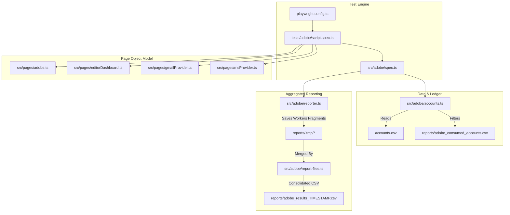
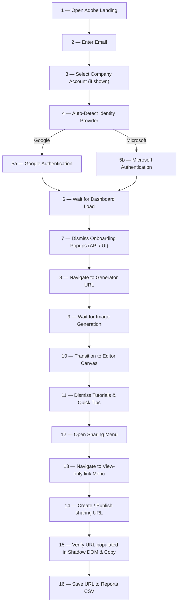

# 🎨 Adobe Express — Playwright TS Automation Suite

[](https://playwright.dev)
[](https://www.typescriptlang.org)
[](#)

A premium, data-driven end-to-end automation framework for **Adobe Express** (`new.express.adobe.com`). This repository orchestrates federated authentication, bypasses complex onboarding indicators, generates AI assets, and manages public sharing links while tracking single-use account consumption with a strict ledger.

---

## 🌟 Key Features

* **📦 Data-Driven Account Isolation:** Automatically loads, normalizes, and dedupes credentials, dynamically declaring **one test per fresh account** at module load.
* **🛡️ Fail-Safe Consumption Ledger:** Tracks consumed accounts persistently to guarantee that no credential is runs twice, preventing token burning or account lockout.
* **⚡ Hybrid Dismissal Flow:** Dismisses the Adobe onboarding dialogs using a direct REST PATCH API payload parsed from captured auth headers, falling back smoothly to UI clicking.
* **🎛️ Shadow-DOM Piercing Links:** Successfully resolves generated sharing links from deeply nested Shadow DOM boundaries inside complex Custom Web Components.
* **🔁 Navigation Interruption Recovery:** Automatically recovers from client-side routing redirects via a retry logic pattern on edit shortcuts.
* **📊 Multi-Worker CSV Reporter:** Aggregates test runs in parallel, writing isolated worker fragments to disk and merging them into unified CSV results reports at completion.

---

## 🏗️ Architecture & Component Flow

The framework divides responsibilities cleanly between specifications, page object layers, and runtime fixtures:



### File Map & Directories

* **[`playwright.config.ts`](file:///c:/Users/QA/WebstormProjects/Adobe_V2/playwright.config.ts)**: Configures global test execution, timeouts, chromium settings, and projects.
* **`src/`**: Core application logic.
  * **[`src/adobe/`](file:///c:/Users/QA/WebstormProjects/Adobe_V2/src/adobe/)**: Core infrastructure.
    * [`accounts.ts`](file:///c:/Users/QA/WebstormProjects/Adobe_V2/src/adobe/accounts.ts): Loader, validator, and normalizer for Adobe credentials.
    * [`fixtures.ts`](file:///c:/Users/QA/WebstormProjects/Adobe_V2/src/adobe/fixtures.ts): Extends Playwright tests with `assignedAccount` and `stepTracker`.
    * [`spec.ts`](file:///c:/Users/QA/WebstormProjects/Adobe_V2/src/adobe/spec.ts): Custom test runner (`defineAdobeAccountTests`) mapping accounts to tests.
    * [`reporter.ts`](file:///c:/Users/QA/WebstormProjects/Adobe_V2/src/adobe/reporter.ts): Custom multi-worker-safe Playwright CSV reporter.
    * [`report-files.ts`](file:///c:/Users/QA/WebstormProjects/Adobe_V2/src/adobe/report-files.ts): File writer managing parallel results fragments and ledger merges.
  * **[`src/pages/`](file:///c:/Users/QA/WebstormProjects/Adobe_V2/src/pages/)**: Page Object classes containing locators and page actions.
    * [`adobe.ts`](file:///c:/Users/QA/WebstormProjects/Adobe_V2/src/pages/adobe.ts): Main landing page, SSO redirection, API dismissal, and editor shortcut navigation.
    * [`editorDashboard.ts`](file:///c:/Users/QA/WebstormProjects/Adobe_V2/src/pages/editorDashboard.ts): Canvas operations, tutorial dismissal, share drawer, and link generation/copy actions.
    * [`gmailProvider.ts`](file:///c:/Users/QA/WebstormProjects/Adobe_V2/src/pages/gmailProvider.ts): Authentication flow for Google federated accounts.
    * [`msProvider.ts`](file:///c:/Users/QA/WebstormProjects/Adobe_V2/src/pages/msProvider.ts): Authentication flow for Microsoft federated accounts.
* **`tests/`**: Suite specifications.
  * **[`tests/adobe/`](file:///c:/Users/QA/WebstormProjects/Adobe_V2/tests/adobe/)**: End-to-end automation scripts (e.g. [`script.spec.ts`](file:///c:/Users/QA/WebstormProjects/Adobe_V2/tests/adobe/script.spec.ts)).
  * **[`tests/internal/`](file:///c:/Users/QA/WebstormProjects/Adobe_V2/tests/internal/)**: Integration and unit tests validating loaders, parsers, and reporters.
* **[`docs/source_of_truth.md`](file:///c:/Users/QA/WebstormProjects/Adobe_V2/docs/source_of_truth.md)**: Deep technical specification documenting detailed page locators and behaviors.

---

## 🔄 End-to-End Test Journey

The main automation script ([`script.spec.ts`](file:///c:/Users/QA/WebstormProjects/Adobe_V2/tests/adobe/script.spec.ts)) runs through the following stages:



### Execution Steps Breakdown

| Step ID | stepTracker Name | Method Called | Page Object | Actions performed |
| :--- | :--- | :--- | :--- | :--- |
| **1** | `open login` | [`adb_login()`](file:///c:/Users/QA/WebstormProjects/Adobe_V2/src/pages/adobe.ts#L35) | `AdobePage` | Open homepage, redirect to Adobe portal |
| **2** | `Enter email at Adobe Login` | [`fill_adb_email_field(email)`](file:///c:/Users/QA/WebstormProjects/Adobe_V2/src/pages/adobe.ts#L42) | `AdobePage` | Sequentially fill email (30ms delay), click Continue |
| **3** | `Handle Personal/Company screen on Adobe Login` | [`select_cmp_option()`](file:///c:/Users/QA/WebstormProjects/Adobe_V2/src/pages/adobe.ts#L54) | `AdobePage` | Selects "Company or School" if prompted |
| **4** | `check email provider` | [`getLoginProvider()`](file:///c:/Users/QA/WebstormProjects/Adobe_V2/src/pages/adobe.ts#L88) | `AdobePage` | Evaluates URL structure to identify identity provider |
| **5** | `Login with <Provider>` | [`g_login()` / `ms_login()`](file:///c:/Users/QA/WebstormProjects/Adobe_V2/src/pages/gmailProvider.ts#L51) | `GmailProvider` / `MsProvider` | Log in through federated auth portal |
| **6** | `Wait for Adobe Dashboard` | [`waitForDashboard()`](file:///c:/Users/QA/WebstormProjects/Adobe_V2/src/pages/adobe.ts#L107) | `AdobePage` | Wait for URL pattern matching `new.express.adobe.com` |
| **7** | `Activate by Lets Go` | [`skipLetsGoViaAPI(email)`](file:///c:/Users/QA/WebstormProjects/Adobe_V2/src/pages/adobe.ts#L188) | `AdobePage` | REST API skip for onboarding popup, falls back to UI click |
| **8** | `Redirect to edit` | [`shortcut()`](file:///c:/Users/QA/WebstormProjects/Adobe_V2/src/pages/adobe.ts#L133) | `AdobePage` | Navigate to Text-to-Image canvas with retry on redirect |
| **9** | `Wait for Img Generation` | [`wait_for_generation()`](file:///c:/Users/QA/WebstormProjects/Adobe_V2/src/pages/adobe.ts#L64) | `AdobePage` | Verify skeleton disappears and thumbnails render |
| **10** | `Open In Editor` | [`clickOpenInEditor()`](file:///c:/Users/QA/WebstormProjects/Adobe_V2/src/pages/editorDashboard.ts#L24) | `EditorDashboard` | Click "Open in editor" |
| **11** | `Skip Tutorial dialog if visible` | [`skipTutorial()`](file:///c:/Users/QA/WebstormProjects/Adobe_V2/src/pages/editorDashboard.ts#L34) | `EditorDashboard` | Dismisses "Skip Tour" or "Got it" tooltips |
| **12** | `Click Share button` | [`clickShare()`](file:///c:/Users/QA/WebstormProjects/Adobe_V2/src/pages/editorDashboard.ts#L56) | `EditorDashboard` | Opens editor Share menu |
| **13** | `Open View Only Link` | [`openViewOnlyLink()`](file:///c:/Users/QA/WebstormProjects/Adobe_V2/src/pages/editorDashboard.ts#L66) | `EditorDashboard` | Access public sharing options |
| **14** | `Click Create Link button` | [`clickCreateLink()`](file:///c:/Users/QA/WebstormProjects/Adobe_V2/src/pages/editorDashboard.ts#L77) | `EditorDashboard` | Triggers URL compilation on backend |
| **15** | `Click Copy Link button` | [`clickCopyLink()`](file:///c:/Users/QA/WebstormProjects/Adobe_V2/src/pages/editorDashboard.ts#L88) | `EditorDashboard` | Asserts input has value, reads URL, clicks Copy |

---

## 💾 Account Consumption Ledger Model

To protect against account lockouts and token exhaustion, credentials in this project are treated as **single-use inputs**. 

* **State Tracking:** A test run checks the central [`accounts.csv`](file:///c:/Users/QA/WebstormProjects/Adobe_V2/accounts.csv) and filters out any credentials already found in `reports/adobe_consumed_accounts.csv`.
* **Consume-on-Start:** Accounts are committed to the ledger as consumed **immediately** upon browser context launch.
* **Failures Consumed:** If a test fails mid-run, the account remains marked as consumed. Tests are configured with **zero retries** by design to protect user records.
* **No Fresh Accounts:** If no unused accounts remain, the suite automatically skips execution and registers a skipped test with the reason `No fresh accounts available`.

---

## 📊 Parallel Reporting Pipeline

The framework uses a custom multi-worker reporter ([`reporter.ts`](file:///c:/Users/QA/WebstormProjects/Adobe_V2/src/adobe/reporter.ts)) to track test outputs in parallel configurations without data corruption:

1. **Worker Isolation:** As parallel workers run, they record test status fragments to worker-specific CSV files under `reports/.tmp/<ADOBE_RUN_ID>/`.
2. **Merge on End:** When the test run finishes, `onEnd()` consolidates the worker CSV fragments into the main results folder.
3. **Artifact Output:**
   * **`reports/adobe_results_TIMESTAMP.csv`**: Contains structured rows detailing timestamp, email, status, last step reached, reason, duration, and the generated public link.
   * **`reports/adobe_consumed_accounts.csv`**: Updates the central database ledger with recently consumed accounts.
   * **`playwright-report/`**: A standard Playwright HTML report containing interactive traces and failed-run screenshots.

---

## 🚀 Quick Start

### Prerequisites
* Node.js 18+
* NPM
* Chromium (Installed via Playwright)

### Installation
1. Install project dependencies:
   ```bash
   npm install
   ```
2. Download browser engines:
   ```bash
   npx playwright install chromium
   ```

### Local Execution Configurations
Provide Adobe credentials in the root directory via **`accounts.csv`**:
```csv
Email,Password
user.one@kvsrogurugram.in,teach2025
user.two@kvsrogurugram.in,teach2025
```

Alternatively, set credentials globally using environment variables:
```bash
# Set CSV File Path Env
$env:ADOBE_ACCOUNTS_CSV="C:\path\to\alternative-accounts.csv"

# Or Set Fallback Credentials
$env:ADOBE_EMAIL="user.one@kvsrogurugram.in"
$env:ADOBE_PASSWORD="password"
```

### CLI Command Reference

* **Build Codebase:**
  ```bash
  npm run build
  ```
* **Run Standard E2E Test Suite (Uses Headless Chromium):**
  ```bash
  npm run test:adobe
  ```
* **Run Infrastructure Checks:**
  ```bash
  npm run test:infra
  ```

---

## ⚙️ Development Notes
* **Headless Default:** Configured to run in `headless: true` mode in [`playwright.config.ts`](file:///c:/Users/QA/WebstormProjects/Adobe_V2/playwright.config.ts) for optimal performance in CI/CD and multi-worker pipelines.
* **Timeouts:** Timed limits are set high (`360s` test timeout, `120s` expect timeout) to account for external latency during federated Google/Microsoft SSO and client-side page rendering.
* **Shadow-DOM Navigation:** The share link copy logic asserts text presence inside shadow scopes using locator `expect(this.publishUrl).toHaveValue(/.../)` rather than document queries, bypassing nested browser restrictions.
