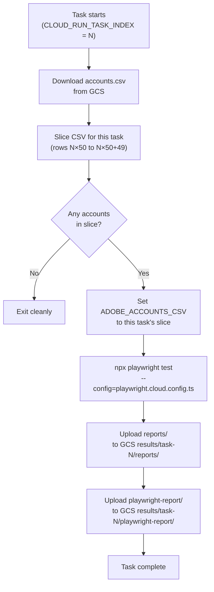

# Adobe Express Playwright — Google Cloud Platform Setup Guide

> **Last updated:** 2026-06-22
> **Scope:** End-to-end instructions for deploying and running the Adobe automation suite on GCP Cloud Run Jobs at scale (20,000+ accounts).

---

## 1. Overview

This guide explains how to run the Playwright Adobe automation on **Google Cloud Run Jobs**. Instead of running tests locally against a CSV file, accounts are split into batches and each batch runs in its own Cloud Run task — in parallel — then results are collected from Cloud Storage.

```
accounts.csv (local)
      │
      ▼
 GCS Bucket ──── accounts.csv ─────────────────────────────────┐
                                                                │
      ┌─────────────────────────────────────────────────────────┘
      │  Cloud Run Job (412 tasks, 50 at a time)
      │
      ├── Task 0  → slice rows 1–50    → Playwright (3 workers) → reports/ → GCS
      ├── Task 1  → slice rows 51–100  → Playwright (3 workers) → reports/ → GCS
      ├── Task 2  → slice rows 101–150 → Playwright (3 workers) → reports/ → GCS
      │   ...
      └── Task 411 → slice rows 20551–20577
                                                                │
                                              GCS Bucket ───── results/
                                                               ├── task-0/reports/adobe_results_*.csv
                                                               ├── task-1/reports/adobe_results_*.csv
                                                               └── ...
```

### Key files added for GCP

| File | Purpose |
|------|---------|
| `Dockerfile` | Container image (Playwright + Chromium + gcloud CLI) |
| `.dockerignore` | Excludes node_modules, CSVs, reports from the image |
| `.gcloudignore` | Excludes the same from gcloud operations |
| `playwright.cloud.config.ts` | Cloud-safe Playwright config — no GPU/D3D11 args |
| `cloudbuild.yaml` | Builds and pushes the Docker image to Artifact Registry |
| `scripts/slice-accounts.mjs` | Slices accounts.csv to a per-task batch |
| `scripts/run-cloud-batch.sh` | Entrypoint for each Cloud Run task |
| `scripts/dispatch-job.sh` | Local script to create and launch the Cloud Run Job |

> **No existing files are modified.** The original `playwright.config.ts` and all `src/` files remain untouched.

---

## 2. What Works vs. What Doesn't on Cloud Run

| Feature | Status | Reason |
|---------|--------|--------|
| Headless Chromium (software) | ✅ Works | `playwright.cloud.config.ts` uses `--no-sandbox`, `--disable-gpu` |
| Adobe login — Google SSO | ✅ Works | No code changes needed |
| Adobe login — Microsoft SSO | ✅ Works | No code changes needed |
| CSV account loading via `ADOBE_ACCOUNTS_CSV` | ✅ Works | Each task sets its own env var pointing to its slice |
| Results CSV to `reports/` | ✅ Works | Uploaded to GCS after each task completes |
| Consumed ledger per task | ✅ Works | Each task gets a fresh container; slicing prevents overlap |
| GPU headless mode (`GPU_MODE = 'headless'`) | ❌ Not used | Cloud Run has no GPU — `playwright.cloud.config.ts` overrides |
| `--use-angle=d3d11` | ❌ Not used | Windows DirectX flag — has no effect on Linux |
| `channel: 'chromium'` (GPU headless) | ❌ Not used | Replaced with standard headless in cloud config |
| Consuming accounts only once globally | ⚠️ Per-task only | Consumed ledger is local to each container; slicing handles global dedup |

---

## 3. Prerequisites

### Local machine

| Tool | Version | Install |
|------|---------|---------|
| [gcloud CLI](https://cloud.google.com/sdk/docs/install) | Latest | `gcloud --version` |
| Docker Desktop | Latest | Required for local image builds/testing |
| Node.js | 18+ | For running `scripts/slice-accounts.mjs` locally if needed |

### GCP account

- A GCP project with **Billing enabled**
- Your user account must have `Owner` or the following roles:
  - `roles/cloudbuild.builds.editor`
  - `roles/artifactregistry.admin`
  - `roles/run.admin`
  - `roles/storage.admin`
  - `roles/iam.serviceAccountAdmin`

---

## 4. One-Time GCP Setup

Run these commands once to prepare your GCP project. Replace `YOUR_PROJECT_ID` throughout.

### 4.1 Authenticate and set project

```bash
gcloud auth login
gcloud config set project YOUR_PROJECT_ID
```

### 4.2 Enable required APIs

```bash
gcloud services enable \
  run.googleapis.com \
  cloudbuild.googleapis.com \
  artifactregistry.googleapis.com \
  storage.googleapis.com \
  iam.googleapis.com
```

### 4.3 Create Artifact Registry repository

This is where your Docker image will be stored.

```bash
gcloud artifacts repositories create adobe-automation \
  --repository-format=docker \
  --location=asia-south1 \
  --description="Adobe Playwright automation images"
```

### 4.4 Create GCS bucket

This bucket holds `accounts.csv` (input) and all results (output).

```bash
# Replace YOUR_BUCKET_NAME with a globally unique name, e.g. mycompany-adobe-automation
gcloud storage buckets create gs://accounts-auto \
  --location=asia-south1 \
  --uniform-bucket-level-access
```

### 4.5 Create a dedicated Service Account

The Cloud Run tasks will run as this service account so they can read/write GCS.

```bash
gcloud iam service-accounts create playwright-runner \
  --display-name="Adobe Playwright Runner" \
  --project=project-517cd71a-7c2f-4e1b-af2
```

Grant it GCS read/write access:

```bash
gcloud projects add-iam-policy-binding project-517cd71a-7c2f-4e1b-af2 \
  --member="serviceAccount:playwright-runner@project-517cd71a-7c2f-4e1b-af2.iam.gserviceaccount.com" \
  --role="roles/storage.objectAdmin"
```

Grant Cloud Run permission to use this service account:

```bash
gcloud projects add-iam-policy-binding project-517cd71a-7c2f-4e1b-af2 \
  --member="serviceAccount:playwright-runner@project-517cd71a-7c2f-4e1b-af2.iam.gserviceaccount.com" \
  --role="roles/run.invoker"
```

Grant Cloud Build permission to deploy Cloud Run Jobs (needed if using Cloud Build):

```bash
# Get your project number
PROJECT_NUMBER=$(gcloud projects describe project-517cd71a-7c2f-4e1b-af2 --format='value(projectNumber)')

gcloud projects add-iam-policy-binding project-517cd71a-7c2f-4e1b-af2 \
  --member="serviceAccount:${PROJECT_NUMBER}@cloudbuild.gserviceaccount.com" \
  --role="roles/run.admin"

gcloud projects add-iam-policy-binding project-517cd71a-7c2f-4e1b-af2 \
  --member="serviceAccount:${PROJECT_NUMBER}@cloudbuild.gserviceaccount.com" \
  --role="roles/iam.serviceAccountUser"
```

---

## 5. Build and Push the Docker Image

The `Dockerfile` uses the official Playwright image (`mcr.microsoft.com/playwright:v1.61.0-noble`) as the base — Chromium is pre-installed, so no browser download happens at build time.

### Option A — Build via Cloud Build (recommended)

This builds the image remotely on GCP — no Docker required locally.

```bash
gcloud builds submit \
  --config=cloudbuild.yaml \
  --substitutions="_REGION=asia-south1,_REPO=adobe-automation,_IMAGE=playwright-adobe" \
  --project=project-517cd71a-7c2f-4e1b-af2
```

After completion the image is available at:
```
asia-south1-docker.pkg.dev/project-517cd71a-7c2f-4e1b-af2/adobe-automation/playwright-adobe:latest
```

### Option B — Build locally and push

```bash
# Authenticate Docker to push to Artifact Registry
gcloud auth configure-docker asia-south1-docker.pkg.dev

IMAGE="asia-south1-docker.pkg.dev/YOUR_PROJECT_ID/adobe-automation/playwright-adobe:latest"

docker build --platform linux/amd64 -t "$IMAGE" .
docker push "$IMAGE"
```

> **Important:** Always build with `--platform linux/amd64`. Cloud Run runs on `linux/amd64` regardless of your local machine architecture (e.g. Apple Silicon Macs use `arm64` by default).

---

## 6. Upload Accounts and Run the Job

### 6.1 Prepare your accounts.csv

The CSV must have at minimum these two columns (additional columns are ignored):

```csv
email,password
user1@company.com,Password123
user2@company.com,Password456
...
```

For 20,577 accounts, the file can be large — Cloud Run will slice it per task, so you only upload once.

### 6.2 Configure and run dispatch-job.sh

Edit the top of `scripts/dispatch-job.sh` or set the variables as shell exports before calling the script:

```bash
export GCP_PROJECT_ID="project-517cd71a-7c2f-4e1b-af2"
export GCS_BUCKET="accounts-auto"
export SERVICE_ACCOUNT="playwright-runner@project-517cd71a-7c2f-4e1b-af2.iam.gserviceaccount.com"

# Optional tuning (defaults shown)
export BATCH_SIZE=50          # accounts per task (50 → 412 tasks for 20,577 accounts)
export PARALLELISM=50         # tasks running simultaneously
export WORKERS_PER_TASK=3     # Chromium workers per task
export MEMORY="4Gi"
export CPU="2"

# Run the dispatch script from the repo root (accounts.csv must be present here)
bash scripts/dispatch-job.sh
```

The script will:
1. Upload `accounts.csv` → `gs://YOUR_BUCKET/accounts.csv`
2. Create (or update) the Cloud Run Job named `adobe-playwright-job`
3. Execute the job and wait for all tasks to finish
4. Print the GCS path where results are stored

### 6.3 What each task does (run-cloud-batch.sh)



---

## 7. Collecting Results

After the job finishes, all results are in GCS.

### Download all results CSVs

```bash
mkdir -p ./results
gcloud storage cp -r "gs://YOUR_BUCKET/results/" ./results/
```

Each task's results CSV is at:
```
results/task-N/reports/adobe_results_<timestamp>.csv
```

### Merge all CSVs into one

```bash
# Get the header from the first CSV found
header_file=$(find ./results -name "adobe_results_*.csv" | head -1)
head -1 "$header_file" > merged_results.csv

# Append all data rows (skip header of each file)
find ./results -name "adobe_results_*.csv" | sort | while read f; do
  tail -n +2 "$f" >> merged_results.csv
done

echo "Merged $(wc -l < merged_results.csv) rows into merged_results.csv"
```

### Results CSV columns

| Column | Description |
|--------|-------------|
| `timestamp` | When the test ran |
| `email` | Adobe account email |
| `test_status` | `passed`, `failed`, or `skipped` |
| `failed_at_step` | Last step reached before failure |
| `failure_reason` | Error message if failed |
| `duration_ms` | Total test duration in milliseconds |
| `published_link` | The view-only Adobe Express link (if passed) |

---

## 8. Scale Reference for 20,577 Accounts

| Setting | Default | Notes |
|---------|---------|-------|
| `BATCH_SIZE` | 50 | Accounts per Cloud Run task |
| Total tasks | **412** | `ceil(20577 / 50)` |
| `PARALLELISM` | 50 | Tasks running at the same time |
| `WORKERS_PER_TASK` | 3 | Chromium instances per task |
| Memory per task | 4 GB | 3 Chrome instances × ~600 MB + Node overhead |
| CPU per task | 2 vCPU | |
| Task timeout | 4 hours | Adobe can be slow; 50 accounts ÷ 3 workers ≈ 60–90 min |
| Estimated wall time | **5–8 hours** | `ceil(412/50)` rounds × ~60 min/task |

### Tuning tips

- **Faster total time:** Increase `PARALLELISM` (e.g. 100) — more tasks run simultaneously. GCP limits: max 1,000 parallel tasks per job.
- **Faster per task:** Increase `WORKERS_PER_TASK` to 5, and `MEMORY` to `6Gi`. More Chromium instances = more accounts processed in parallel within the task.
- **Reduce cost:** Increase `BATCH_SIZE` to 100 — fewer tasks = less startup overhead. Adjust task timeout accordingly (`~120–150 min`).
- **Reduce risk of timeout:** Decrease `BATCH_SIZE` to 25 — smaller batches finish faster and are less likely to hit the timeout.

---

## 9. Playwright Cloud Config — What Changed

`playwright.cloud.config.ts` replaces the GPU-heavy local config with Linux/Cloud Run-safe settings:

| Setting | Local (`playwright.config.ts`) | Cloud (`playwright.cloud.config.ts`) |
|---------|-------------------------------|-------------------------------------|
| GPU mode | `'headless'` (GPU-capable headless via D3D11) | `'off'` — standard software headless |
| `--use-angle=d3d11` | ✅ Included | ❌ Removed — Windows DirectX only |
| `channel: 'chromium'` | ✅ Included | ❌ Removed — not needed without GPU |
| `--no-sandbox` | ❌ Not set | ✅ Required in Docker containers |
| `--disable-setuid-sandbox` | ❌ Not set | ✅ Required in Docker containers |
| `--disable-dev-shm-usage` | ❌ Not set | ✅ Prevents Chromium crashes (shared memory limit in containers) |
| `--disable-gpu` | ❌ Not set | ✅ Explicit GPU-off for Cloud Run |
| Workers | Hardcoded `3` | Reads `WORKERS` env var (default `3`) |
| `CI` workers override | 1 worker if `CI=true` | Not applied — cloud config manages its own workers |
| Retries | 0 | 0 |
| Trace | off (BULK=true) | off |
| Projects | `adobe-chromium` + `internal-chromium` | `adobe-chromium` only |

---

## 10. Monitoring and Troubleshooting

### Monitor a running job

```bash
# Watch live task status
gcloud run jobs executions describe JOB_EXECUTION_NAME \
  --region=asia-south1 \
  --project=YOUR_PROJECT_ID

# Or open the Cloud Console:
# https://console.cloud.google.com/run/jobs
```

### View logs for a specific task

In GCP Console → Cloud Run → Jobs → `adobe-playwright-job` → Executions → click a task → Logs.

Or via CLI:
```bash
gcloud logging read \
  'resource.type="cloud_run_job" AND resource.labels.job_name="adobe-playwright-job"' \
  --project=YOUR_PROJECT_ID \
  --limit=100 \
  --format="table(timestamp, textPayload)"
```

### Common failures

| Symptom | Cause | Fix |
|---------|-------|-----|
| Task exits immediately with "no accounts" | Batch size doesn't divide evenly into last task | Normal — last task may have fewer accounts |
| `GCS_BUCKET env var must be set` | Env var not passed to Cloud Run Job | Re-run `dispatch-job.sh` with `GCS_BUCKET` exported |
| `accounts.csv not found in GCS` | Upload step failed | Check `dispatch-job.sh` output; upload manually with `gcloud storage cp` |
| Chromium crashes with OOM | Not enough memory | Increase `MEMORY` to `6Gi` or reduce `WORKERS_PER_TASK` to 2 |
| Task hits 4h timeout | Adobe is slow + too many accounts per task | Reduce `BATCH_SIZE` to 25 |
| `No fresh accounts available` (test skipped) | Slice file is empty | Check `slice-accounts.mjs` output — last task may have 0 rows for edge case |
| Google/MS SSO fails | Stale credentials | Fix passwords in `accounts.csv` and re-upload to GCS |

---

## 11. Quick Reference — Commands

```bash
# ── One-time setup ─────────────────────────────────────────────────────────
gcloud auth login
gcloud config set project YOUR_PROJECT_ID
gcloud services enable run.googleapis.com cloudbuild.googleapis.com \
  artifactregistry.googleapis.com storage.googleapis.com iam.googleapis.com

gcloud artifacts repositories create adobe-automation \
  --repository-format=docker --location=asia-south1

gcloud storage buckets create gs://YOUR_BUCKET --location=asia-south1

gcloud iam service-accounts create playwright-runner --project=YOUR_PROJECT_ID
gcloud projects add-iam-policy-binding YOUR_PROJECT_ID \
  --member="serviceAccount:playwright-runner@YOUR_PROJECT_ID.iam.gserviceaccount.com" \
  --role="roles/storage.objectAdmin"

# ── Build image ─────────────────────────────────────────────────────────────
gcloud builds submit --config=cloudbuild.yaml --project=YOUR_PROJECT_ID

# ── Run the job ─────────────────────────────────────────────────────────────
GCP_PROJECT_ID=YOUR_PROJECT_ID \
GCS_BUCKET=YOUR_BUCKET \
SERVICE_ACCOUNT=playwright-runner@YOUR_PROJECT_ID.iam.gserviceaccount.com \
bash scripts/dispatch-job.sh

# ── Collect results ─────────────────────────────────────────────────────────
gcloud storage cp -r "gs://YOUR_BUCKET/results/" ./results/
```

---

## 12. Cost Estimate

Cloud Run Jobs pricing (as of mid-2026 — verify current rates):

| Resource | Rate | Per task (50 accounts, ~60 min) |
|----------|------|--------------------------------|
| CPU (2 vCPU × 3600s) | ~$0.000024/vCPU-s | ~$0.17 |
| Memory (4 GB × 3600s) | ~$0.0000025/GB-s | ~$0.036 |
| **Per task total** | | **~$0.21** |
| **All 412 tasks** | | **~$86** |

> Actual cost varies with task duration and GCP region. Cloud Storage egress costs are minimal for CSV files. Artifact Registry storage and Cloud Build minutes add a small additional cost.

---

*For questions about the test flow itself (steps, locators, fixtures), see [source_of_truth.md](./source_of_truth.md).*
