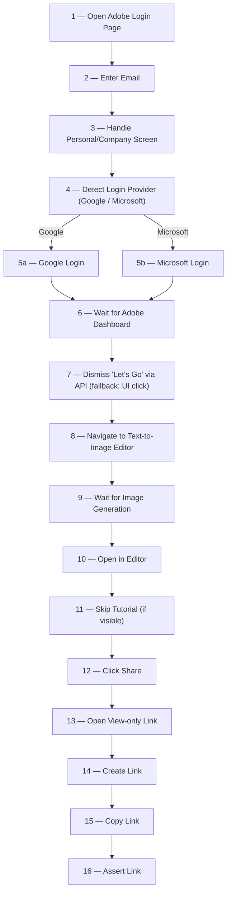
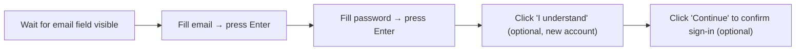
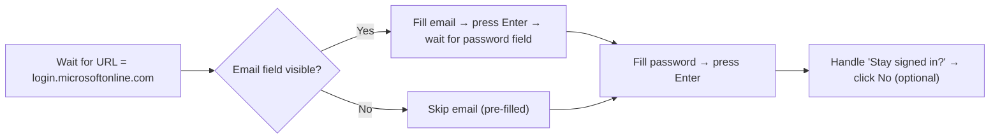
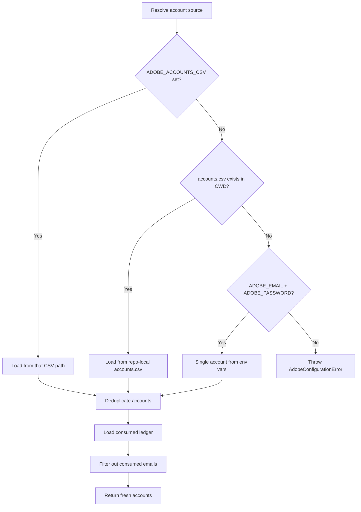
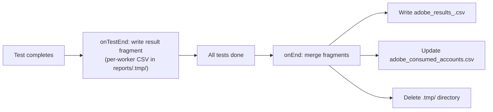

# Adobe Express — Playwright Test Automation: Source of Truth

> **Last updated:** 2026-06-11  
> **Scope:** Full end-to-end test flow defined in [script.spec.ts](file:///c:/Users/QA/WebstormProjects/Adobe_V2/tests/adobe/script.spec.ts) and all supporting modules.

---

## 1. Project Overview

This project is a **Playwright-based E2E test suite** that automates the following workflow on **Adobe Express** (`new.express.adobe.com`):

1. Log in with a federated account (Google or Microsoft)
2. Handle first-time onboarding dialogs
3. Navigate to the AI image generator (Text-to-Image)
4. Wait for image generation
5. Download the generated image

Tests are **data-driven** — each test run consumes one or more accounts from a CSV file, marks them as consumed, and produces a results CSV report.

---

## 2. High-Level Test Flow



---

## 3. Step-by-Step Flow Breakdown (script.spec.ts)

Each step below maps to a `stepTracker.setStep(...)` call in [script.spec.ts](file:///c:/Users/QA/WebstormProjects/Adobe_V2/tests/adobe/script.spec.ts). The step tracker records the **last completed step** so that failures can be attributed to a specific stage in the CSV report.

| # | Step Name (stepTracker) | Method Called | Page Object | What Happens |
|---|------------------------|---------------|-------------|--------------|
| 1 | `open login` | [adb_login()](file:///c:/Users/QA/WebstormProjects/Adobe_V2/src/pages/adobe.ts#L35-L40) | `AdobePage` | Navigates to `https://new.express.adobe.com/` and waits for redirect to `auth.services.adobe.com` |
| 2 | `Enter email at Adobe Login` | [fill_adb_email_field(email)](file:///c:/Users/QA/WebstormProjects/Adobe_V2/src/pages/adobe.ts#L42-L48) | `AdobePage` | Fills the email field character-by-character (30ms delay), then clicks Continue |
| 3 | `Handle Personal/Company screen on Adobe Login` | [select_cmp_option()](file:///c:/Users/QA/WebstormProjects/Adobe_V2/src/pages/adobe.ts#L50-L58) | `AdobePage` | If a "Select an account" screen appears with "Company or School Account", clicks it (3s timeout, soft fail) |
| 4 | `check email provider` | [getLoginProvider()](file:///c:/Users/QA/WebstormProjects/Adobe_V2/src/pages/adobe.ts#L84-L101) | `AdobePage` | Waits (up to 90s) for the URL to redirect to either `accounts.google.com` or `login.microsoftonline.com`, then returns the URL |
| 5 | `Login with <provider>` | [g_login()](file:///c:/Users/QA/WebstormProjects/Adobe_V2/src/pages/gmailProvider.ts#L51-L59) or [ms_login()](file:///c:/Users/QA/WebstormProjects/Adobe_V2/src/pages/msProvider.ts#L37-L56) | `GmailProvider` / `MsProvider` | Performs SSO login through the detected provider (see §4 below) |
| 6 | `Wait for Adobe Dashboard` | [waitForDashboard()](file:///c:/Users/QA/WebstormProjects/Adobe_V2/src/pages/adobe.ts#L103-L108) | `AdobePage` | Waits for URL to match `new.express.adobe.com` (soft fail on timeout) |
| 7 | `Activate by Lets Go` | [skipLetsGoViaAPI(email)](file:///c:/Users/QA/WebstormProjects/Adobe_V2/src/pages/adobe.ts#L174-L231) | `AdobePage` | Fires a `PATCH` to Adobe's UDS API to set `education-survey.role = "student"` (~0.7s). Auth header and ownerEntity are captured passively from UDS requests during dashboard load. Falls back to [handle_letsGo()](file:///c:/Users/QA/WebstormProjects/Adobe_V2/src/pages/adobe.ts#L128-L137) UI click if capture fails. |
| 8 | `Redirect to edit` | [shortcut()](file:///c:/Users/QA/WebstormProjects/Adobe_V2/src/pages/adobe.ts#L120-L122) | `AdobePage` | Directly navigates to the Text-to-Image editor with a pre-filled prompt (`"Festival"`, 1080×1080, digital art style) |
| 9 | `Wait for Img Generation` | [wait_for_generation()](file:///c:/Users/QA/WebstormProjects/Adobe_V2/src/pages/adobe.ts#L60-L64) | `AdobePage` | Asserts: thumbnail image is visible, download icon is enabled, skeleton loader count is 0 |
| 10 | `Open In Editor` | [clickOpenInEditor()](file:///c:/Users/QA/WebstormProjects/Adobe_V2/src/pages/editorDashboard.ts#L24-L32) | `EditorDashboard` | Clicks "Open in editor" button (20s timeout, soft-fail) |
| 11 | `Skip Tutorial dialog if visible` | [skipTutorial()](file:///c:/Users/QA/WebstormProjects/Adobe_V2/src/pages/editorDashboard.ts#L34-L41) | `EditorDashboard` | Clicks "Skip tour" if tutorial overlay appears (20s timeout, soft-fail) |
| 12 | `Click Share button` | [clickShare()](file:///c:/Users/QA/WebstormProjects/Adobe_V2/src/pages/editorDashboard.ts#L44-L52) | `EditorDashboard` | Clicks Share button (`#share-btn`) in editor nav bar (20s timeout, soft-fail) |
| 13 | `Open View Only Link` | [openViewOnlyLink()](file:///c:/Users/QA/WebstormProjects/Adobe_V2/src/pages/editorDashboard.ts#L54-L62) | `EditorDashboard` | Clicks "View-only link" menu item (20s timeout, soft-fail) |
| 14 | `Click Create Link button` | [clickCreateLink()](file:///c:/Users/QA/WebstormProjects/Adobe_V2/src/pages/editorDashboard.ts#L64-L72) | `EditorDashboard` | Clicks "Create link" button (`#ptwPublishBtn`) to generate view-only URL (20s timeout, soft-fail) |
| 15 | `Click Copy Link button` | [clickCopyLink()](file:///c:/Users/QA/WebstormProjects/Adobe_V2/src/pages/editorDashboard.ts#L74-L87) | `EditorDashboard` | Clicks "Copy link", reads URL from `Published URL` input field, returns trimmed string |
| 16 | *(assertion)* | `expect(link).toBeTruthy()` | — | Verifies the published link is non-empty |

---

## 4. Login Provider Details

### 4a. Google Login — [GmailProvider](file:///c:/Users/QA/WebstormProjects/Adobe_V2/src/pages/gmailProvider.ts)



| Locator | Selector |
|---------|----------|
| `email_field` | `getByLabel('Email or phone')` |
| `password_field` | `getByLabel('Enter your password')` |
| `welcome_screen` | `getByText('Welcome to your new account')` |
| `i_understand_button` | `getByRole('button', { name: /I understand/i })` |
| `confirm_sign_in_button` | `getByRole('button', { name: /^Continue$/i })` |

### 4b. Microsoft Login — [MsProvider](file:///c:/Users/QA/WebstormProjects/Adobe_V2/src/pages/msProvider.ts)



| Locator | Selector |
|---------|----------|
| `email_field` | `getByLabel('Enter your email, phone, or Skype.')` |
| `password_field` | `getByPlaceholder('Password')` |
| `stay_signIn_msg` | `getByText('Stay signed in?')` |
| `reject_stay_sign_in` | `locator('input[type="button"]')` |

---

## 5. AdobePage — Complete Locator Reference

All locators are defined in the [AdobePage constructor](file:///c:/Users/QA/WebstormProjects/Adobe_V2/src/pages/adobe.ts#L22-L36).

| Property | Selector | Used In |
|----------|----------|---------|
| `email_field` | `getByRole('textbox', { name: 'Email address' })` | `fill_adb_email_field` |
| `email_field_continue` | `getByLabel('Continue')` | `fill_adb_email_field` |
| `downld_icon` | `getByLabel('Download').first()` | `wait_for_generation`, `download_img` |
| `single_img_radio_btn` | `getByText("Selected image")` | `download_img` |
| `downld_btn` | `getByText("Download").last()` | `download_img` |
| `loadIndicator` | `getByTestId('firefly-skeleton')` | `wait_for_generation` |
| `selected_card` | `locator(".selected.card")` | *(unused currently)* |
| `letsGo_btn` | `getByTestId('x-dialog-primary-cta')` | `handle_letsGo` *(fallback only)* |
| `sltNaccount` | `getByRole('heading', { name: 'Select an account' })` | `select_cmp_option` |
| `cmp_option` | `getByText('Company or School Account')` | `select_cmp_option` |
| `genratedImg` | `getByTestId('firefly-thumbnail-image').first()` | `wait_for_generation` |
| `letsGoIndicator` | `getByRole('heading', { name: /Help us customize…/i })` | `isLetsGoIndicator_Visible` *(unused)* |

### 5b. AdobePage — Key Methods Reference

| Method | Purpose | Notes |
|--------|---------|-------|
| `adb_login()` | Navigate to Adobe Express and wait for auth redirect | Soft-fail |
| `fill_adb_email_field(email)` | Type email and click Continue | Character-by-character, 30ms delay |
| `select_cmp_option()` | Click "Company or School Account" if visible | Soft-fail, 3s timeout |
| `getLoginProvider()` | Wait for redirect to Google/Microsoft, return URL | 90s timeout, throws on unknown provider |
| `waitForDashboard()` | Wait for URL = `new.express.adobe.com` | Soft-fail |
| `startUdsCapture()` | Begin passively intercepting UDS requests for auth + ownerEntity | **Call once**, before dashboard loads |
| `skipLetsGoViaAPI(email)` | Dismiss Let's Go via `PATCH` API; falls back to UI click | Requires `startUdsCapture()` to have been called |
| `handle_letsGo(email)` | Wait for Let's Go dialog + click button | Retained as fallback, 20s timeout, soft-fail |
| `shortcut()` | Navigate directly to Text-to-Image editor | Bypasses dashboard UI |
| `wait_for_generation()` | Assert image generated (thumbnail visible, skeleton gone) | |
| `download_img()` | Click download → select image → save to `./downloads/` | Returns file path *(currently unused, replaced by share flow)* |

### 5c. EditorDashboard — Locator Reference

All locators defined in [EditorDashboard constructor](file:///c:/Users/QA/WebstormProjects/Adobe_V2/src/pages/editorDashboard.ts#L13-L22).

| Property | Selector | Used In |
|----------|----------|---------|
| `openInEditor` | `getByRole('button', { name: 'Open in editor' })` | `clickOpenInEditor` |
| `skipTutorial_btn` | `getByText('Skip tour')` | `skipTutorial` |
| `navSharebtn` | `locator('#share-btn')` | `clickShare` |
| `viewOnlyLink` | `getByRole('menuitem', { name: 'View-only link' })` | `openViewOnlyLink` |
| `createLinkBtn` | `locator('#ptwPublishBtn')` | `clickCreateLink` |
| `copyLinkBtn` | `getByRole('button', { name: 'Copy link' })` | `clickCopyLink` |
| `publishUrl` | `getByLabel('Published URL')` | `clickCopyLink` |

### 5d. EditorDashboard — Key Methods Reference

| Method | Purpose | Notes |
|--------|---------|-------|
| `clickOpenInEditor()` | Click "Open in editor" button | 20s timeout, soft-fail |
| `skipTutorial()` | Click "Skip tour" if tutorial overlay appears | 20s timeout, soft-fail |
| `clickShare()` | Click Share button in editor nav bar | 20s timeout, soft-fail |
| `openViewOnlyLink()` | Click "View-only link" in share menu | 20s timeout, soft-fail |
| `clickCreateLink()` | Click "Create link" to generate the URL | 20s timeout, soft-fail |
| `clickCopyLink()` | Click "Copy link" and read the published URL | Returns URL string, `''` on failure |

---

## 6. Architecture & File Map

```
Adobe_V2/
├── tests/adobe/
│   └── script.spec.ts            ← Main test file (the flow)
├── src/
│   ├── pages/
│   │   ├── adobe.ts              ← AdobePage page object
│   │   ├── editorDashboard.ts    ← EditorDashboard page object (share flow)
│   │   ├── gmailProvider.ts      ← Google login page object
│   │   └── msProvider.ts         ← Microsoft login page object
│   ├── adobe/
│   │   ├── spec.ts               ← defineAdobeAccountTests() — test generator
│   │   ├── fixtures.ts           ← Custom Playwright fixtures (account, stepTracker, context)
│   │   ├── accounts.ts           ← Account loading, dedup, freshness filtering
│   │   ├── types.ts              ← TypeScript type definitions
│   │   ├── runtime.ts            ← Constants, run-ID generation, path helpers
│   │   ├── reporter.ts           ← Custom CSV reporter (AdobeCsvReporter)
│   │   ├── report-files.ts       ← Fragment writing & merge logic
│   │   └── csv.ts                ← CSV parse/write utilities
│   └── index.ts                  ← Public API barrel export
├── accounts.csv                  ← Source accounts (email, password)
├── downloads/                    ← Downloaded images land here
├── reports/                      ← Generated CSV reports
└── playwright.config.ts          ← Playwright configuration
```

---

## 7. Test Infrastructure Deep Dive

### 7.1 Account System

Defined in [accounts.ts](file:///c:/Users/QA/WebstormProjects/Adobe_V2/src/adobe/accounts.ts):



- **Source priority:** `ADOBE_ACCOUNTS_CSV` env var → repo-local `accounts.csv` → `ADOBE_EMAIL` + `ADOBE_PASSWORD` env vars
- **Consumed ledger:** `reports/adobe_consumed_accounts.csv` — emails that have already been used are skipped
- **Deduplication:** First occurrence wins; warns if duplicate emails have conflicting passwords

### 7.2 Test Generation — [defineAdobeAccountTests](file:///c:/Users/QA/WebstormProjects/Adobe_V2/src/adobe/spec.ts#L25-L41)

For each fresh account, the function creates a **`test.describe` block** scoped to that email, with the account injected via `test.use({ assignedAccount })`. If zero fresh accounts remain, the entire test is **skipped** with reason `"No fresh accounts available"`.

### 7.3 Custom Fixtures — [fixtures.ts](file:///c:/Users/QA/WebstormProjects/Adobe_V2/src/adobe/fixtures.ts)

| Fixture | Type | Purpose |
|---------|------|---------|
| `assignedAccount` | Option | The `AdobeAccount` injected by `defineAdobeAccountTests` |
| `account` | Test fixture | Validates the assigned account exists; attaches account metadata as a JSON attachment to the test result |
| `stepTracker` | Test fixture | Provides `setStep(name)` / `getStep()` API; on teardown, attaches the last step as JSON to the test result for the reporter |
| `context` | Test fixture (override) | Creates a fresh browser context per test; writes the account email to the consumed-fragments ledger at test start |

### 7.4 Reporting Pipeline — [reporter.ts](file:///c:/Users/QA/WebstormProjects/Adobe_V2/src/adobe/reporter.ts) + [report-files.ts](file:///c:/Users/QA/WebstormProjects/Adobe_V2/src/adobe/report-files.ts)



**Results CSV columns:** `timestamp`, `email`, `test_status`, `failed_at_step`, `failure_reason`, `duration_ms`

**Consumed CSV columns:** `email`, `consumed_at`

### 7.5 Playwright Configuration — [playwright.config.ts](file:///c:/Users/QA/WebstormProjects/Adobe_V2/playwright.config.ts)

| Setting | Value | Notes |
|---------|-------|-------|
| Test timeout | **360s** (6 min) | Accommodates slow SSO + image generation |
| Expect timeout | **120s** (2 min) | For assertion waits (e.g., image appearing) |
| Action timeout | **120s** | Individual click/fill actions |
| Navigation timeout | **240s** (4 min) | Page navigations |
| Headless | **false** | Runs with visible browser |
| Retries | **0** | No retries (accounts are consumed on first attempt) |
| Fully parallel | **true** | Multiple accounts run concurrently |
| Project | `adobe-chromium` | Matches `tests/adobe/*.spec.ts` using Desktop Chrome |
| Reporter | HTML + Custom `AdobeCsvReporter` | |

---

## 8. Key Design Decisions & Notes

> [!IMPORTANT]
> **One-shot accounts:** Each account is consumed on first use (written to the consumed ledger at context creation time). There are **no retries** — if a test fails, that account is still marked consumed.

> [!NOTE]
> **Soft-fail patterns:** Several steps use `try/catch {}` with empty catch blocks (e.g., `adb_login`, `select_cmp_option`, `waitForDashboard`, `handle_letsGo`). This means those steps will silently proceed even if the expected element doesn't appear, relying on later steps to fail if something went wrong.

> [!NOTE]
> **The `shortcut()` method** bypasses normal UI navigation by directly loading the Text-to-Image editor URL with query parameters for prompt, dimensions, and style. This avoids navigating through the Adobe Express dashboard UI.

> [!NOTE]
> **`selected_card` locator** (`.selected.card`) is defined but not used anywhere in the current codebase.

> [!NOTE]
> **API-based Let's Go dismissal (v4 optimization):** The "Let's Go" onboarding dialog is now dismissed via a direct `PATCH` to `https://new.express.adobe.com/service/uds/userdocs/uds-projectx`, setting `education-survey.role = "student"`. This saves ~10.6 seconds per test compared to the UI click. The `startUdsCapture()` method passively intercepts UDS requests during login/dashboard load to capture the `authorization` header and `ownerEntity`. If capture fails, it falls back to the original `handle_letsGo()` UI click.

> [!NOTE]
> **`handle_letsGo()` is retained** as a fallback method in `AdobePage`. It is called automatically by `skipLetsGoViaAPI()` if the auth header or ownerEntity couldn't be captured from network traffic.

---

## 9. Environment Variables Reference

| Variable | Required | Default | Description |
|----------|----------|---------|-------------|
| `ADOBE_ACCOUNTS_CSV` | No | — | Path to a custom accounts CSV file |
| `ADOBE_EMAIL` | No | — | Single-account fallback email |
| `ADOBE_PASSWORD` | No | — | Single-account fallback password |
| `ADOBE_RUN_ID` | Auto-set | Generated from timestamp + PID | Unique identifier for this test run |
| `ADOBE_LOW_NETWORK_DEBUG` | No | — | Set to `1` to run only `*.low-network.debug.spec.ts` files |
| `CI` | No | — | If truthy, sets workers to 1 and enables `forbidOnly` |

---

## 10. Data Types Quick Reference

From [types.ts](file:///c:/Users/QA/WebstormProjects/Adobe_V2/src/adobe/types.ts):

```typescript
type AdobeAccount = { email: string; password: string }

type StepTracker = {
  setStep(step: string): void
  getStep(): string | undefined
}

type AdobeResultStatus = 'passed' | 'skipped' | 'failed'

type AdobeResultRow = {
  timestamp: string; email: string; test_status: AdobeResultStatus
  failed_at_step: string; failure_reason: string; duration_ms: string
}

type AdobeConsumedRow = { email: string; consumed_at: string }
```
