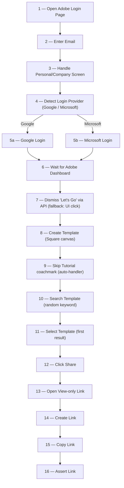
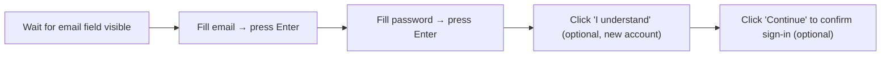
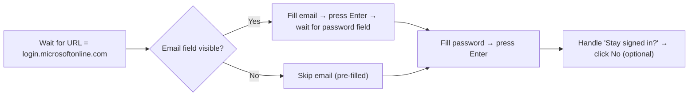
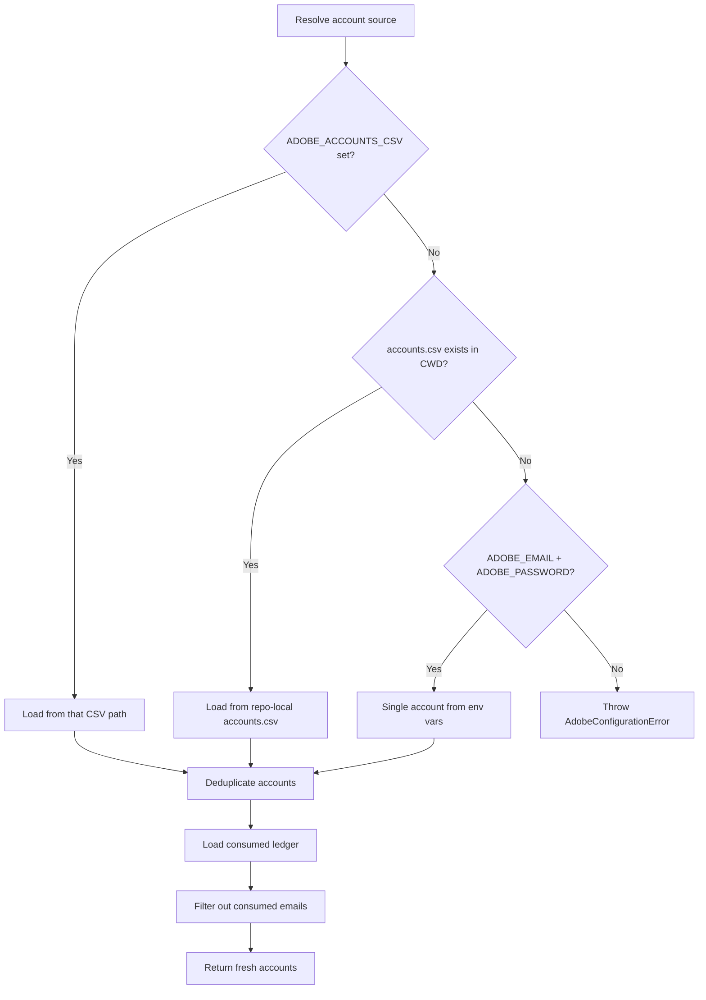
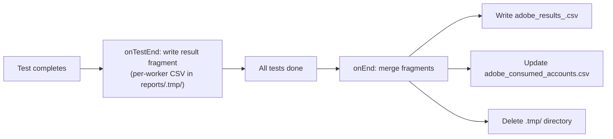

# Adobe Express — Playwright Test Automation: Source of Truth

> **Last updated:** 2026-06-21  
> **Scope:** Full end-to-end test flow defined in [script.spec.ts](file:///c:/Users/QA/WebstormProjects/Adobe_V2/tests/adobe/script.spec.ts) and all supporting modules.

---

## 1. Project Overview

This project is a **Playwright-based E2E test suite** that automates the following workflow on **Adobe Express** (`new.express.adobe.com`):

1. Log in with a federated account (Google or Microsoft)
2. Dismiss first-time onboarding ("Let's Go") via a direct API call
3. Create a new **Square** canvas from the template picker
4. Search the template gallery for a (random) keyword
5. Select a template from the results
6. Open the **Share** panel → create a **view-only link**
7. Copy and assert the published link

Tests are **data-driven** — each test run consumes one or more accounts from a CSV file, marks them as consumed, and produces a results CSV report.

> **Note:** The earlier Text-to-Image **image-generation + download** path (`shortcut()`, `wait_for_generation()`, `download_img()`, `clickOpenInEditor()`) is no longer part of the active flow. Those steps are commented out in `script.spec.ts` and the methods are retained as legacy helpers. See §8.

---

## 2. High-Level Test Flow



---

## 3. Step-by-Step Flow Breakdown (script.spec.ts)

Each step below maps to a `stepTracker.setStep(...)` call in [script.spec.ts](file:///c:/Users/QA/WebstormProjects/Adobe_V2/tests/adobe/script.spec.ts). The step tracker records the **last completed step** so that failures can be attributed to a specific stage in the CSV report.

| # | Step Name (stepTracker) | Method Called | Page Object | What Happens |
|---|------------------------|---------------|-------------|--------------|
| 1 | `open login` | `adb_login()` | `AdobePage` | Navigates to `https://new.express.adobe.com/` and waits for redirect to `auth.services.adobe.com` |
| 2 | `Enter email at Adobe Login` | `fill_adb_email_field(email)` | `AdobePage` | Fills the email field character-by-character (30ms delay), then clicks Continue |
| 3 | `Handle Personal/Company screen on Adobe Login` | `select_cmp_option()` | `AdobePage` | If a "Select an account" screen appears with "Company or School Account", clicks it (3s timeout, soft fail) |
| 4 | `check email provider` | `getLoginProvider()` | `AdobePage` | Waits (up to 90s) for the URL to redirect to either `accounts.google.com` or `login.microsoftonline.com`, then returns the URL |
| 5 | `Login with <provider>` | `g_login()` or `ms_login()` | `GmailProvider` / `MsProvider` | Performs SSO login through the detected provider (see §4) |
| 6 | `Wait for Adobe Dashboard` | `waitForDashboard()` | `AdobePage` | Waits for URL to match `new.express.adobe.com`; throws if it never lands |
| 7 | `Activate by Lets Go` | `skipLetsGoViaAPI(email)` | `AdobePage` | Fires a `PATCH` to Adobe's UDS API to set `education-survey.role = "student"` (~0.7s). Auth header and ownerEntity are captured passively from UDS requests during dashboard load. Falls back to `handle_letsGo()` UI click if capture fails. |
| 8 | `Setup Canvas` | `createTemplate()` | `AdobePage` | Clicks **"Create new"**, then the **"Square"** template — opens the editor with the template/search panel |
| 9 | `Skip Tutorial dialog if visible` | `skipTutorial()` | `EditorDashboard` | Registers an `addLocatorHandler` that auto-dismisses the "Try the updated editor" **coachmark** ("Skip tour") whenever it appears; also dismisses a "Got it" popup if present |
| 10 | `Search Template` | `getRandomSearchKeyword()` + `searchForTemplate(keyword)` | `AdobePage` | Picks a random keyword from the pool, clicks the search bar, types the keyword, presses Enter |
| 11 | `Select Template` | `selectTemplate(keyword)` | `AdobePage` | Asserts the results-count text (format-tolerant), then clicks the first result via its own DOM click handler to bypass hover-preview `<video>` / search-plugin overlays |
| 12 | `Click Share button` | `clickShare()` | `EditorDashboard` | Clicks Share button (`#share-btn`) in editor nav bar |
| 13 | `Open View Only Link` | `openViewOnlyLink()` | `EditorDashboard` | Waits up to **180s** for the "View-only link" menuitem (covers slow file prep), then clicks it |
| 14 | `Click Create Link button` | `clickCreateLink()` | `EditorDashboard` | Clicks "Create link"; waits for **either** the "Copy link" button **or** the rendered published URL (handles both panel variants) |
| 15 | `Click Copy Link button` | `clickCopyLink()` | `EditorDashboard` | Clicks "Copy link" if present (best-effort), then reads the URL from the rendered `publishedV2` link and returns it |
| 16 | *(assertion)* | `expect(link).toBeTruthy()` | — | Verifies the published link is non-empty; attaches it to the test result for the CSV report |

---

## 4. Login Provider Details

### 4a. Google Login — [GmailProvider](file:///c:/Users/QA/WebstormProjects/Adobe_V2/src/pages/gmailProvider.ts)



| Locator | Selector |
|---------|----------|
| `email_field` | `getByLabel('Email or phone')` |
| `password_field` | `getByLabel('Enter your password')` |
| `welcome_screen` | `getByText('Welcome to your new account')` |
| `i_understand_button` | `getByRole('button', { name: /I understand/i })` |
| `confirm_sign_in_button` | `getByRole('button', { name: /^Continue$/i })` |

> **Known failure mode:** if an account's password is stale, Google stops on the "Welcome / Enter your password" screen ("Your password was changed N months ago"). The flow then times out at **Wait for Adobe Dashboard**. This is a credential/data problem, not a code bug — retries will not help; refresh the password in `accounts.csv`.

### 4b. Microsoft Login — [MsProvider](file:///c:/Users/QA/WebstormProjects/Adobe_V2/src/pages/msProvider.ts)



| Locator | Selector |
|---------|----------|
| `email_field` | `getByLabel('Enter your email, phone, or Skype.')` |
| `password_field` | `getByPlaceholder('Password')` |
| `stay_signIn_msg` | `getByText('Stay signed in?')` |
| `reject_stay_sign_in` | `locator('input[type="button"]')` |

---

## 5. AdobePage — Locator & Method Reference

Locators are defined in the [AdobePage constructor](file:///c:/Users/QA/WebstormProjects/Adobe_V2/src/pages/adobe.ts).

### 5a. AdobePage — Locator Reference

| Property | Selector | Used In |
|----------|----------|---------|
| `email_field` | `getByRole('textbox', { name: 'Email address' })` | `fill_adb_email_field` |
| `email_field_continue` | `getByLabel('Continue')` | `fill_adb_email_field` |
| `sltNaccount` | `getByRole('heading', { name: 'Select an account' })` | `select_cmp_option` |
| `cmp_option` | `getByText('Company or School Account')` | `select_cmp_option` |
| `letsGo_btn` | `getByTestId('x-dialog-primary-cta')` | `handle_letsGo` *(fallback only)* |
| `createNew` | `getByRole('button', { name: 'Create new' })` | `createTemplate` |
| `squareTemplate` | `getByText('Square', { exact: true })` | `createTemplate` |
| `searchBar` | `getByRole('combobox', { name: 'Search Instagram square post' })` | `searchForTemplate` |
| `resultCountText` | `getByTestId('results-count-text')` | `selectTemplate` |
| `templateResult` | `locator('button.thumbnail-button-filler').first()` | `selectTemplate` |
| `genratedImg` | `getByTestId('firefly-thumbnail-image').first()` | `wait_for_generation` *(legacy)* |
| `downld_icon` | `getByLabel('Download').first()` | `wait_for_generation`, `download_img` *(legacy)* |
| `single_img_radio_btn` | `getByText("Selected image")` | `download_img` *(legacy)* |
| `downld_btn` | `getByText("Download").last()` | `download_img` *(legacy)* |
| `loadIndicator` | `getByTestId('firefly-skeleton')` | `wait_for_generation` *(legacy)* |
| `selected_card` | `locator(".selected.card")` | *(unused)* |
| `letsGoIndicator` | `getByRole('heading', { name: /Help us customize…/i })` | `isLetsGoIndicator_Visible` *(unused)* |

### 5b. AdobePage — Key Methods Reference

| Method | Purpose | Notes |
|--------|---------|-------|
| `adb_login()` | Navigate to Adobe Express and wait for auth redirect | Soft-fail on goto; confirms redirect |
| `fill_adb_email_field(email)` | Type email and click Continue | Character-by-character, 30ms delay |
| `select_cmp_option()` | Click "Company or School Account" if visible | Soft-fail, 3s timeout |
| `getLoginProvider()` | Wait for redirect to Google/Microsoft, return URL | 90s timeout, throws on unknown provider |
| `waitForDashboard()` | Wait for URL = `new.express.adobe.com` | Throws if it never lands (login failed) |
| `startUdsCapture()` | Begin passively intercepting UDS requests for auth + ownerEntity | **Call once**, before dashboard loads |
| `skipLetsGoViaAPI(email)` | Dismiss Let's Go via `PATCH` API; falls back to UI click | Requires `startUdsCapture()` to have been called |
| `handle_letsGo(email)` | Wait for Let's Go dialog + click button | Retained as fallback, 20s timeout, soft-fail |
| `createTemplate()` | Click "Create new" → "Square" to open a canvas | Enabled/visible gating before each click |
| `getRandomSearchKeyword()` | Return a random keyword from the pool | Synchronous; pool defined in constructor |
| `searchForTemplate(keyword)` | Click search bar, type keyword, press Enter | Coachmark interception handled by `skipTutorial`'s `addLocatorHandler` |
| `selectTemplate(keyword)` | Assert results then click the first result | Format-tolerant count assertion; clicks via the element's own click handler to bypass overlays |
| `shortcut()` | Navigate directly to Text-to-Image editor | **Legacy** — not in active flow |
| `wait_for_generation()` | Assert image generated | **Legacy** — not in active flow |
| `download_img()` | Download generated image to `./downloads/` | **Legacy** — not in active flow |

### 5c. EditorDashboard — Locator Reference

All locators defined in the [EditorDashboard constructor](file:///c:/Users/QA/WebstormProjects/Adobe_V2/src/pages/editorDashboard.ts).

| Property | Selector | Used In |
|----------|----------|---------|
| `openInEditor` | `getByRole('button', { name: 'Open in editor' })` | `clickOpenInEditor` *(legacy)* |
| `skipTutorial_btn` | `getByText('Skip tour')` | `skipTutorial` |
| `navSharebtn` | `locator('#share-btn')` | `clickShare` |
| `viewOnlyLink` | `getByRole('menuitem', { name: 'View-only link' })` | `openViewOnlyLink` |
| `createLinkBtn` | `getByText('Create link').first()` | `clickCreateLink` |
| `copyLinkBtn` | `getByRole('button', { name: 'Copy link' })` | `clickCreateLink`, `clickCopyLink` |
| `publishUrl` | `locator('a[href^="https://new.express.adobe.com/publishedV2/"]').first()` | `clickCreateLink`, `clickCopyLink` |

### 5d. EditorDashboard — Key Methods Reference

| Method | Purpose | Notes |
|--------|---------|-------|
| `clickOpenInEditor()` | Click "Open in editor" button | **Legacy** — not in active flow; 20s timeout |
| `skipTutorial()` | Auto-dismiss the editor coachmark tour | Registers `page.addLocatorHandler('Skip tour', …)` so the "Try the updated editor" overlay is cleared whenever it appears (no fixed wait); also dismisses "Got it" if present |
| `clickShare()` | Click Share button in editor nav bar | Fail-fast: 20s enabled-gate |
| `openViewOnlyLink()` | Wait for + click the "View-only link" menuitem | Waits up to **180s** for the menuitem (end-state wait that covers slow file prep), then clicks |
| `clickCreateLink()` | Click "Create link" to generate the URL | Waits for **either** the "Copy link" button **or** the rendered published URL — supports both share-panel variants |
| `clickCopyLink()` | Read the published view-only URL | Clicks "Copy link" if present (best-effort); the rendered `publishedV2` `<a href>` is the source of truth. Returns the URL string |

---

## 6. Architecture & File Map

```
Adobe_V2/
├── tests/adobe/
│   └── script.spec.ts            ← Main test file (the flow)
├── src/
│   ├── pages/
│   │   ├── adobe.ts              ← AdobePage page object
│   │   ├── editorDashboard.ts    ← EditorDashboard page object (share flow)
│   │   ├── gmailProvider.ts      ← Google login page object
│   │   └── msProvider.ts         ← Microsoft login page object
│   ├── adobe/
│   │   ├── spec.ts               ← defineAdobeAccountTests() — test generator
│   │   ├── fixtures.ts           ← Custom Playwright fixtures (account, stepTracker, context)
│   │   ├── accounts.ts           ← Account loading, dedup, freshness filtering
│   │   ├── types.ts              ← TypeScript type definitions
│   │   ├── runtime.ts            ← Constants, run-ID generation, path helpers
│   │   ├── reporter.ts           ← Custom CSV reporter (AdobeCsvReporter)
│   │   ├── report-files.ts       ← Fragment writing & merge logic
│   │   └── csv.ts                ← CSV parse/write utilities
│   └── index.ts                  ← Public API barrel export
├── accounts.csv                  ← Source accounts (email, password)
├── downloads/                    ← Downloaded images land here (legacy flow)
├── reports/                      ← Generated CSV reports (gitignored)
└── playwright.config.ts          ← Playwright configuration
```

---

## 7. Test Infrastructure Deep Dive

### 7.1 Account System

Defined in [accounts.ts](file:///c:/Users/QA/WebstormProjects/Adobe_V2/src/adobe/accounts.ts):



- **Source priority:** `ADOBE_ACCOUNTS_CSV` env var → repo-local `accounts.csv` → `ADOBE_EMAIL` + `ADOBE_PASSWORD` env vars
- **Consumed ledger:** `reports/adobe_consumed_accounts.csv` — emails that have already been used are skipped
- **Deduplication:** First occurrence wins; warns if duplicate emails have conflicting passwords

### 7.2 Test Generation — [defineAdobeAccountTests](file:///c:/Users/QA/WebstormProjects/Adobe_V2/src/adobe/spec.ts)

For each fresh account, the function creates a **`test.describe` block** scoped to that email, with the account injected via `test.use({ assignedAccount })`. If zero fresh accounts remain, the entire test is **skipped** with reason `"No fresh accounts available"`.

### 7.3 Custom Fixtures — [fixtures.ts](file:///c:/Users/QA/WebstormProjects/Adobe_V2/src/adobe/fixtures.ts)

| Fixture | Type | Purpose |
|---------|------|---------|
| `assignedAccount` | Option | The `AdobeAccount` injected by `defineAdobeAccountTests` |
| `account` | Test fixture | Validates the assigned account exists; attaches account metadata as a JSON attachment to the test result |
| `stepTracker` | Test fixture | Provides `setStep(name)` / `getStep()` API; on teardown, attaches the last step as JSON to the test result for the reporter |
| `context` | Test fixture (override) | Creates a fresh browser context per test; writes the account email to the consumed-fragments ledger at test start |

### 7.4 Reporting Pipeline — [reporter.ts](file:///c:/Users/QA/WebstormProjects/Adobe_V2/src/adobe/reporter.ts) + [report-files.ts](file:///c:/Users/QA/WebstormProjects/Adobe_V2/src/adobe/report-files.ts)



**Results CSV columns:** `timestamp`, `email`, `test_status`, `failed_at_step`, `failure_reason`, `duration_ms`, `published_link`

**Consumed CSV columns:** `email`, `consumed_at`

### 7.5 Playwright Configuration — [playwright.config.ts](file:///c:/Users/QA/WebstormProjects/Adobe_V2/playwright.config.ts)

| Setting | Value | Notes |
|---------|-------|-------|
| Test timeout | **360s** (6 min) | Accommodates slow SSO + file prep |
| Expect timeout | **120s** (2 min) | Default for assertion waits |
| Action timeout | **120s** | Individual click/fill actions |
| Navigation timeout | **240s** (4 min) | Page navigations |
| `BULK` knob | **true** | Traces off, multi-worker (faster bulk runs) |
| `WORKERS` | **3** | Used when `BULK=true`; network-bound, tunable |
| `GPU_MODE` | **`'headless'`** | GPU-capable headless via `channel: 'chromium'` (no window, real GPU). Other modes: `'off'` (software headless), `'headed'` (visible window, 1 worker) |
| Retries | **0** | No retries (accounts are consumed on first attempt) |
| Fully parallel | **true** | Multiple accounts run concurrently |
| Project | `adobe-chromium` | Matches `tests/adobe/*.spec.ts` using Desktop Chrome |
| Reporter | HTML + Custom `AdobeCsvReporter` | |

> Pass `--headed` on the CLI to override `GPU_MODE` for a single debugging run.

---

## 8. Key Design Decisions & Notes

> [!IMPORTANT]
> **One-shot accounts:** Each account is consumed on first use (written to the consumed ledger at context creation time). There are **no retries** — if a test fails, that account is still marked consumed.

> [!NOTE]
> **Coachmark auto-handler:** The "Try the updated editor" coachmark tour appears at an unpredictable time after the editor loads, and its `<x-coachmark-underlay>` intercepts pointer events on later steps (notably the search bar). `skipTutorial()` registers a Playwright `addLocatorHandler` so that whenever "Skip tour" becomes visible during any action, it is clicked and the action retried — no fixed wait penalty when no tour appears. This replaced an earlier one-shot `isVisible()` check that raced the tour's delayed render.

> [!NOTE]
> **Overlay-bypass template click:** In `selectTemplate()`, the first result is often an animated template whose hover-preview `<video>` (and the sticky search header) overlay the empty `button.thumbnail-button-filler`, so a normal click is intercepted. The method invokes the button's own click handler via `evaluate(el => el.click())` to bypass the occluding layers.

> [!NOTE]
> **Format-tolerant results assertion:** The results-count text varies — it echoes the query for narrow searches (`878 results for "Birthday"`) but shows a generic count for large categories (`11,000+ results`). `selectTemplate()` verifies the keyword only when the text echoes it; otherwise it just confirms results were returned.

> [!NOTE]
> **Share-panel variants:** After "Create link", some accounts show a labeled "Copy link" button while others render the link directly with an icon-only copy control. `clickCreateLink()` waits for whichever appears, and `clickCopyLink()` reads the rendered `publishedV2` `<a href>` as the source of truth (clicking "Copy link" only when present).

> [!NOTE]
> **View-only prep timeout:** After clicking Share, Adobe shows "We're working on your file…" while it prepares the document; the share options appear only once that completes. `openViewOnlyLink()` waits directly for the "View-only link" menuitem (the end state) for up to **180s**, rather than racing the prep message. Some files prep even slower and may still time out — that is Adobe-side slowness.

> [!NOTE]
> **API-based Let's Go dismissal:** The "Let's Go" onboarding dialog is dismissed via a direct `PATCH` to `https://new.express.adobe.com/service/uds/userdocs/uds-projectx`, setting `education-survey.role = "student"` (~0.7s vs ~10.6s for the UI click). `startUdsCapture()` passively intercepts UDS requests during login/dashboard load to capture the `authorization` header and `ownerEntity`; on failure it falls back to `handle_letsGo()`.

> [!NOTE]
> **Legacy image-generation path:** `shortcut()`, `wait_for_generation()`, `download_img()` (AdobePage) and `clickOpenInEditor()` (EditorDashboard) belong to the original Text-to-Image generate-and-download flow. They are retained but commented out of `script.spec.ts`; the active flow uses the template search + view-only-link path.

---

## 9. Environment Variables Reference

| Variable | Required | Default | Description |
|----------|----------|---------|-------------|
| `ADOBE_ACCOUNTS_CSV` | No | — | Path to a custom accounts CSV file |
| `ADOBE_EMAIL` | No | — | Single-account fallback email |
| `ADOBE_PASSWORD` | No | — | Single-account fallback password |
| `ADOBE_RUN_ID` | Auto-set | Generated from timestamp + PID | Unique identifier for this test run |
| `ADOBE_LOW_NETWORK_DEBUG` | No | — | Set to `1` to run only `*.low-network.debug.spec.ts` files |
| `CI` | No | — | If truthy, sets workers to 1 and enables `forbidOnly` |

---

## 10. Data Types Quick Reference

From [types.ts](file:///c:/Users/QA/WebstormProjects/Adobe_V2/src/adobe/types.ts):

```typescript
type AdobeAccount = { email: string; password: string }

type StepTracker = {
  setStep(step: string): void
  getStep(): string | undefined
}

type AdobeResultStatus = 'passed' | 'skipped' | 'failed'

type AdobeResultRow = {
  timestamp: string; email: string; test_status: AdobeResultStatus
  failed_at_step: string; failure_reason: string; duration_ms: string
}

type AdobeConsumedRow = { email: string; consumed_at: string }
```
